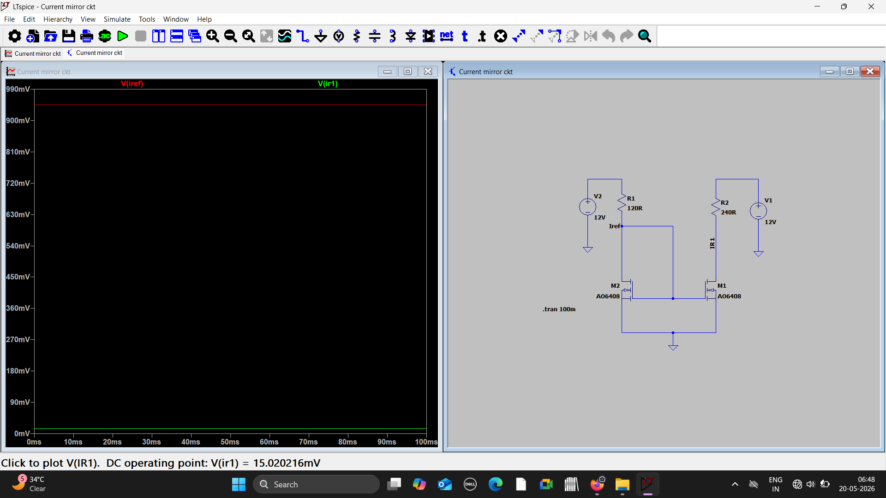
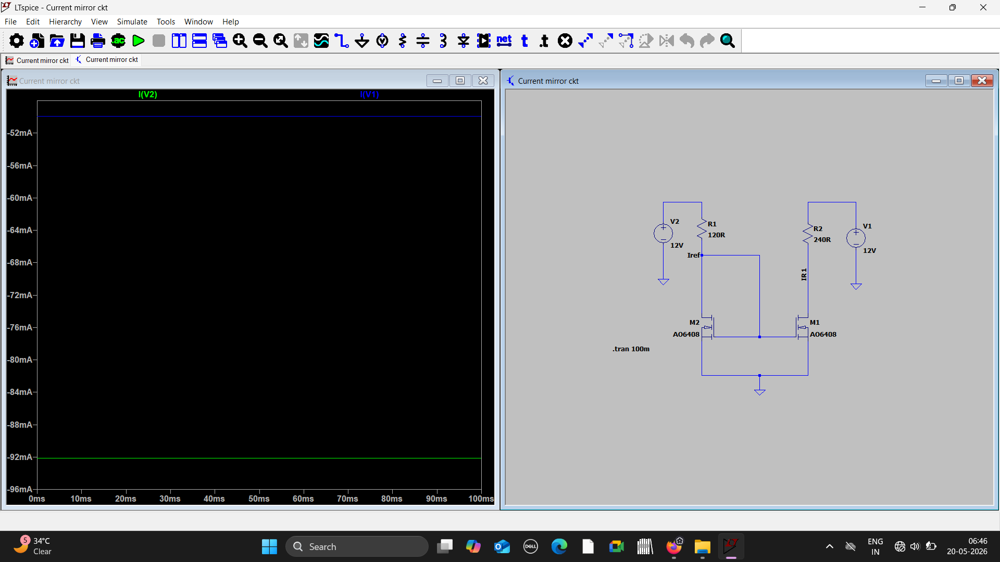

# Current Mirror Circuit using LTspice

## Objective
Designed and stimulated Current Mirror Circuit using LTspice.

## Concepts used
- Analog CMOS circuit fundamentals
- MOSFET biasing 
- Cuurent Mirroring
  

## Circuit Schematic 

## Output Waveforms

_ 
_ 
_ 

## Results
Observed current replication between reference and output branches of the current mirror circuit.

## Tools used
- LTspice
